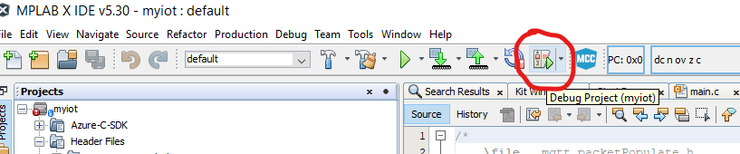

# PIC 16 - Sample Code

This page shows the steps needed to get the PIC 16 board to work with the Embedded C SDK.

## Prerequisites

You should have the following ready before beginning:

-   [Setup your IoT hub](https://github.com/Azure/azure-iot-device-ecosystem/blob/master/setup_iothub.md)

-   [MPLAB X IDE V5.30 or later](https://www.microchip.com/mplab/mplab-x-ide)

-   [XC16 Compiler v1.50 or later](https://www.microchip.com/mplab/compilers)

-   MPLAB code configurator (Once you finish the installation of the previous items, open the MPLAB X IDE, then click Tools > Plugin Download > search for MPLAB code configurator)

# Sample Instructions

## Get the files

1. Get the sample from GitHub: [Link to Eric's GitHub repo](https://garage-06.visualstudio.com/MicrochipIoT%202027%2088114/_git/PIC_IoT?version=GBmaster)

2. Open the project in MPLAB X: File > Open Project > select the folder in which you just downloaded the files

## Get the Device ID (cumbersome version)

1. On the left hand panel, look for Source files > MCC Generated Files > cloud > mqtt_packetPopulate.c 

2. Add a breakpoint on line 139
3. Enable the file Registry view by clicking on Window > Target Memory Views > File Registers
4. Right click on the memory panel and select One byte view

5. Click on debug project icon and wait until the breakpoint gets activated (you'll know the debugging is ready when the line 139 gets green.

6. On the file register window, click the blue arrow pointing down, and enter 0x24bc on the enter Hex Address field, then click Go To.

7. The device ID we need is shown as in the picture below. Select both lines, copy its content, paste it on Notepad so you can get rid of the points, the spaces and to make it a single line.

8. Create a new Device on your IoT Hub, and its name should be exactly like the Device ID you got in this step:

## Running the Sample

1. Let's update the Wi-Fi credentials and security: on the left hand panel, look for Header files > MCC Generated Files > config > config_winc.h

- 	Update your SSID on line 24
-   Update your Password on line 39
-   On line 34 you should have the definition for your Wi-Fi security (Most home routers use M2M_WIFI_SEC_WPA_PSK, and if that's your case you should see line 34 like in the picture below.)

    
 
2. Update the device key:  on the left hand panel, look for Header files > MCC Generated Files > cloud > mqtt_packetPopulate.f

- On line 46 replace the "XXXXXXXXX" for your device key from IoT Hub

3. Update the hub connection string:  on the left hand panel, look for Header files > MCC Generated Files > config> IoT_sensor_Node_config.h

- On line 23 replace the content for your device key from IoT Hub

- Note: you don't need the whole connection string, you only need the host name. 
- In the example connection string below, the highlighted is the part you need to update on line 23. 

HostName=**ps-demo-hub.azure-devices.net**;DeviceId=Pic_test_2;SharedAccessKey=PsPq+m3gtcvYs=

3. Once you have all the credentials set, you can upload the code to your device, by clicking on debug project.

- If everything goes well, you should see the onboard LEDs turning on. The blue and the green LEDs will be on all the time and the yellow one blinks every 5 seconds to confirm the telemetry has been sent to Azure.

## Calling a direct method on the device

1. On your device window on Azure, click Direct Method

2. On the direct method window, type blink on the Method Name, type {"duration":3}  on the payload, and click "Invoke method". 

3. You should see the red LED turning on for 3 seconds and then turning back off again.

